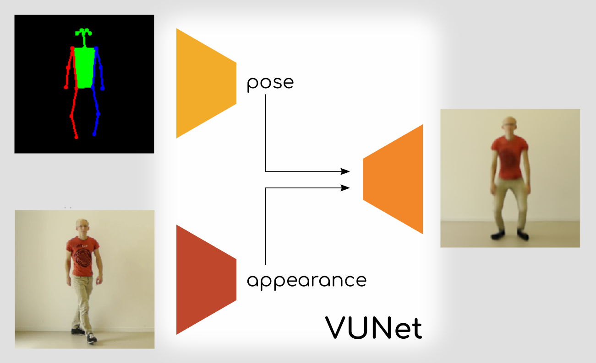

# VUNet

VUNet models images as being generated by two underlying factors: pose and
apperance. It learns to use an estimate of pose to then disentangle appearance.



VUNet has been published by Esser et al.  <span id="a1">[[1]](#f1)</span>.
A follow up paper by Esser et al. <span id="a1">[[2]](#f2)</span> shows the
capabilities of VUNet as a render engine.

This repository gives you VUNet implemented using `pytorch` and all training
code in an hopefully easy to use form.

## Installation

Create a conda environment ([conda installation](https://docs.conda.io/en/latest/miniconda.html))
```bash
conda create -n vunet python pip jupyter
conda activate vunet
```

This model is defined using `pytorch`. Depending on you system, you will maybe
need a fitting version. Find out what you need at
[pytorch.com](https://pytorch.org/get-started). Usually you should be fine with

```bash
conda install pytorch torchvision cudatoolkit=10.1 -c pytorch
```

Now install this repo as a python package:

```bash
git clone https://github.com/jhaux/VUNet.git
cd VUNet
pip install -e .
```

Now you are good to go!


## Quick start

To test if your installation is running, start a training:
```bash
cd VUNet/configs

# add a link to your log directory
# if you leave this out a log/ folder will be automatically created here.
ln -s <your/path/here> logs

edflow -n test_vunet -b base.yaml prjoti.yaml -t
```
Replace `<your/path/here>` with a directory, you want to log the training
outputs to. You can also leave this out.

The first time you run this command it will download a small debug training
dataset. To learn more about this dataset and what kind of data VUNet expects,
take a look at [Data.md](Data.md).

Detail about how to train this VUNet instance and what the ominous `edflow`
command is all about can be found under [Training.md](Training.md).

Starting this training will create a project directory under `logs/` of the
form:

```bash
logs
├── <timestamp>_test_vunet
│   ├── configs
│   ├── eval
│   │   ├── <evaluation folder>
│   │   ...
│   ├── train
│   │   ├── checkpoints
│   │   │   ├── <model_checkpoint_at_step>
│   │   │   ...
│   │   └── log.txt
│   └── log.txt
├── <other experiments>
...
```

Each experiment stores the config that defines each training or evaluation
under `configs`. Training logs, like images and including checkpoints are
stored under `train`. Evaluation outputs are stored in seperate folders for
each evaluation under `eval`.

## Using the model

To play around with a trained model, start the jupyter notebook
[VUNet in action.ipynb](<VUNet in action.ipynb>).
There you can experiment with various inputs and exchange checkpoints, should
you have already started a training.

Should you have own data, that you want to train the model on, please take a
look at how to prepare you dataset in [Data.md](Data.md) and then at
[Training.md](Training.md) to learn about how to train models using `edflow`.


## Working with the code

The structure of this repo follows the `edflow` project structure:

1. [VUNet/configs/](VUNet/configs/) contains configuration files, which define all
   hyperparameters of the model and training.
2. [VUNet/iterator.py](VUNet/iterator.py) contains the training and evaluation
   logic. The iterator iterates over a given dataset as defined in the config
   and executes its method `step_op` on each batch. Depending on if the
   iterator is run in training mode or not, the `train_op` returned by this
   method is executed as well. In certain intervals the returned `log_op` is
   called as well, and after a whole epoch of training the `eval_op` is run on
   the entire validation dataset.  Inside the iterator also loading and storing
   of checkpoints is defined.
3. [VUNet/models/vunet.py](VUNet/models/vunet.py) contains the actual model
   definition. 


# edflow

To learn more about `edflow` and how to use it to do evaluations, trainings or
parameter sweeps, visit the [homepage](github.com/pesser/edflow) of the project
or take a look at the [documentation](edflow.readthedocs.io).


# References

<span id="f1">\[1\]</span>:  [paper][v1] | [project page][v2]
```
@article{vunet2018,
  title={A Variational U-Net for Conditional Appearance and Shape Generation},
  author={Esser, Patrick and Sutter, Ekaterina and Ommer, Bj{\"o}rn},
  year={2018}
}
```

<span id="f2">\[2\]</span>: [paper][r1] | [project page][r2]
```
@article{rerender2018,
  title={Towards Learning a Realistic Rendering of Human Behavior},
  author={Esser, Patrick and Haux, Johannes and Milbich, Timo and Ommer, Bj{\"o}rn},
  year={2018}
}
```


[v1]: https://compvis.github.io/vunet/images/vunet.pdf
[v2]: https://compvis.github.io/vunet/
[r1]: https://compvis.github.io/hbugen2018/images/rerender.pdf
[r2]: https://compvis.github.io/hbugen2018/
